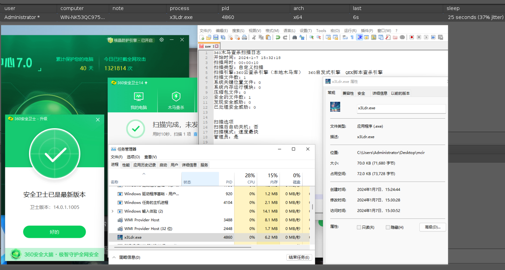

> 免责声明：本工具仅供安全研究和教学目的使用，用户须自行承担因使用该工具而引起的一切法律及相关责任。作者概不对任何法律责任承担责任，且保留随时中止、修改或终止本工具的权利。使用者应当遵循当地法律法规，并理解并同意本声明的所有内容。


一个 Cobalt Stirke 插件，依赖 nim。

**注意：icon 需要在 /tmp/icon.o**

**安装 nim 环境**

```
apt isntall nim
nimble install winim
```

过 qvm 需要图标。编一个放 /tmp目录 名为 icon.o

加载后，工具会出现在 attack -> CSx3Ldr。

也可以使用快捷键 Ctrl + J。

过不了就换 icon

## 效果图




## 换 icon

**icon.rc**

```
demo2 ICON "app.ico"
```

找小的 ico 图标，比如 5kb、10kb 的

```
> x86_64-w64-mingw32-windres -F pe-x86-64 icon.rc -O coff -o icon.o

> cp icon.o /tmp/icon.o
```


# 不生成 exe 怎么办？

等待20-40秒

排错步骤：

如果下面的程序没有编译成功，就说明环境有问题。根据编译结果来排错

```bash
┌──(root㉿kali)-[~]
└─# cat hello.nim                                         
import winim
{.link: "/tmp/icon.o".}
echo "Hello, World!"
                                                                                                                                                                      
┌──(root㉿kali)-[~]
└─# cp ~/CobaltStrike/CS-plugin/CSx3Ldr/icon.o /tmp/icon.o
                                                                                                                                                                      
┌──(root㉿kali)-[~]
└─# nim c -d=release -d=mingw --app=gui --cpu=amd64 --opt:size -d:strip hello.nim
Hint: used config file '/etc/nim/nim.cfg' [Conf]
Hint: used config file '/etc/nim/config.nims' [Conf]
.................................................................................................................................................
/root/hello.nim(1, 8) Warning: imported and not used: 'winim' [UnusedImport]
Hint:  [Link]
Hint: gc: refc; opt: size; options: -d:release
1275906 lines; 3.510s; 280.109MiB peakmem; proj: /root/hello.nim; out: /root/hello.exe [SuccessX]
```


# 参考 

https://github.com/byt3bl33d3r/OffensiveNim

https://github.com/RCStep/CSSG

https://github.com/hack2fun/BypassAV
